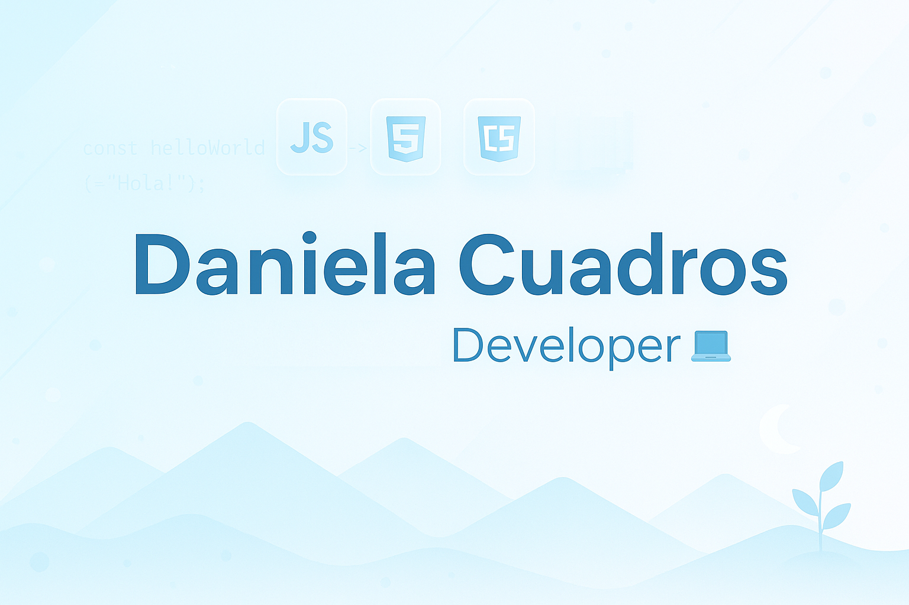

# Daniela Cuadros

---

## Sobre mí
Soy **desarrolladora de software** con conocimientos en frontend, backend y bases de datos.  
Me interesa crear proyectos que sean útiles, claros y fáciles de usar.  
Estoy iniciando en el mundo laboral, con la motivación de crecer en el área tecnológica y aportar valor en cada proyecto.

Cuento además con **formación en administración de Salesforce**, lo que me permite conectar el desarrollo técnico con la gestión de plataformas empresariales.

---

## Tecnologías

### Frontend  
 
 

### Backend  
 

### Bases de datos  

### CRM / Cloud  

---

## Proyectos
- **Haven** – Tienda virtual con carrito de compras.  
- **Gestor de clientes** – CRUD con Spring Boot y MySQL.  

---

## Contacto
- 📍 Colombia  
- 📬 **daniicuadros@gmail.com**  
- 🔗 [LinkedIn](https://www.linkedin.com/in/danielacuadrosmoreno)  
- 🔗 [GitHub](https://github.com/danielacuadros)
